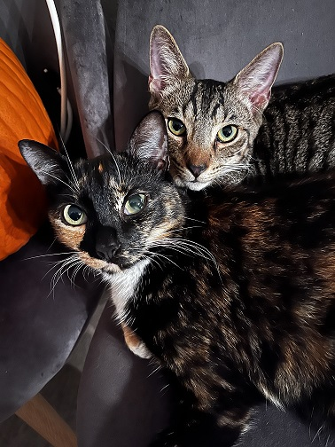

# progdata-class
my work with programming with data

## Introduction

Hello everyone! My name is Reilly, and I am currently a Senior Psychology major here at USF. I am graduating this semester with my minor in Criminology, and I plan on spending another year here at USF completing research in Dr. Sanocki's Vision, Attention and Cognition Lab, as well as Dr. Schneider's Judgement and Decision Making Lab. Fun fact about me: in the fifth grade, I wrote my Tropicana Speech™ on mac 'n cheese :)

## About Me

I was born and raised in Tampa, and I have two older sisters, both of whom also attended USF.
I have two cats, Billie and Artichoke (Artie), and my partner and I love them very much. 

## Hobbies

Some of my hobbies include:

1. music
2. hiking
3. hanging with my cats and partner 

Listening to music is an activity that I spend a majority of my time doing. Some of my favorite artists are **Tyler The Creator**, **SZA**, **Frank Ocean**, and **Rex Orange County**.

[Here is a link to my Spotify](https://open.spotify.com/user/reilly.orman?si=da532f50d73d4f40)

